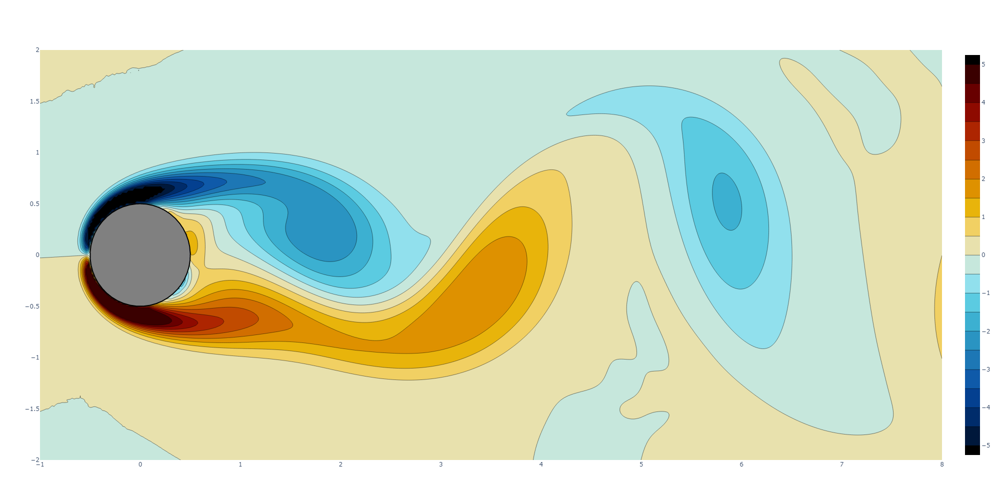

.. ROM documentation master file, created by
   sphinx-quickstart on Thu Apr  7 09:48:44 2022.
   You can adapt this file completely to your liking, but it should at least
   contain the root `toctree` directive.

Welcome to ROM's documentation!
===============================

ROM is a reduced order model regression package with implementations of the ROMs introduced in `Bollinger (2022) <???>`_ (link will be available once published).

.. toctree::
   :maxdepth: 2
   :caption: Contents:
   
   rom
   license

Description
-----------

Reduced order models (ROMs) are used to approximate high-dimensional complex systems by simpler, often interpretable low-dimensional systems. This python package contains two ROMs developed in `Bollinger (2022) <???>`_ (link will be available once published). Examples (using Jupyter notebooks) of how to apply this code are found in the "examples" folder in this repository, and the datasets used in these examples (and in the work cited above) are found in the "data" folder.

How it works:
^^^^^^^^^^^^^

Suppose you want to model a (high-dimensional) system :math:`f:\mathbb{R}^m\to\mathbb{R}^n` (with :math:`m \gg 1`), with a low :math:`k`-dimensional (:math:`k<m`) ROM. The ROMs available in this package take the following form:

.. math::

    f(x)\approx \tilde{f}(U^T x)

where :math:`U\in\mathbb{R}^{m\times k}` is a linear dimension reduction step, and :math:`\tilde{f}:\mathbb{R}^k\to\mathbb{R}^n` is a nonlinear function which approximates :math:`f` on the reduced space defined by :math:`U`. For the ROMs developed in `Bollinger (2022) <???>`_ (link will be available once published), :math:`U` and :math:`\tilde{f}` can be learned in the following ways (to be chosen by the user depending on the context of the problem):

:math:`U`
"""""""""

* :code:`rom.subspaces.AS` = learned via active subspaces (requires derivative information, or approximations thereof--can use :code:`rom.gradients.local_linear_gradients`)
* :code:`rom.subspaces.POD` = learned via proper orthogonal decomposition (used in certain applications, e.g. with time-series data)

:math:`\tilde{f}`
"""""""""""""""""

* :code:`rom.surr_model.NN_alt` = Shallow ReLU Network (uses alternating minimization scheme to update :math:`U`, which is first initialized by one of the above methods)
* :code:`rom.surr_model.RF` = Random Features (shallow network structure with first layer randomized and held fixed, only last layer is trained)

Example:
^^^^^^^^

In this example, we walk through how to train ROM's RF model on fluid vorticity data (a time-series dataset).

.. code-block:: python
   
   import rom
   import numpy as np
   import plotly.graph_objects as go
   
The vorticity data can be found `here <http://dmdbook.com/>`_.
To load the data, just replace the :code:`data_dir` variable with the appropriate path to the dataset. Since the :code:`.npy` data file is too large to store in this repository, it is available at the provided link. To follow this example, the load the data as an :code:`ndarray` with snapshots stored in rows.

.. code-block:: python

   data_dir = 'data/vorticity/X.npy'
   data = np.load(data_dir)
   X = data[:-1,:]
   Y = data[1:,:]
   
We will use the first 75 snapshots for training:

.. code-block:: python

   num_train =  75
   X_train = X[:num_train,:]
   Y_train = Y[:num_train,:]
   
To train the RF model, we first learn the :math:`k` dimensional linear subspace :math:`U\in\mathbb{R}^{d \times k}` via POD.

.. code-block:: python

   k = 6

   ss = rom.subspaces
   U = ss.POD(X_train,k)

   UTX = np.matmul(X,U)
   UTX_train = UTX[:num_train,:]
   
Then, we train the RF surrogate model:

.. code-block:: python

    model = rom.surr_model.RF()
    model.train([UTX_train, Y_train])
    
Using the trained model, we then regenerate all 150 snapshots:

.. code-block:: python

    X_curr = [X[0,:].reshape(1,-1)]
    for num_snapshot in range(data.shape[0]-1):
        UTX_curr = np.matmul(X_curr[-1],U)
        X_curr.append(model.predict(UTX_curr))
    
    X_calc = np.concatenate(X_curr,axis=0)
    
    print(f'relative error = {rom.utils.rel_error(data,X_calc)}')
    
To visualize our generated snapshot at time :code:`time_show`, we display its contour plot:

.. code-block:: python

   time_show = 100

   levels = 0.5
   color = 'IceFire'
   
   num_x = 199
   num_y = 449
   
   # vorticity
   PLOT_RF = np.copy(X_calc)
   PLOT_RF[PLOT_RF>5.] = 5.
   PLOT_RF[PLOT_RF<-5.] = -5.
   
   # cylinder
   scale=2
   theta = np.linspace(0,1,1000)*2*np.pi
   x_cyl = (np.sin(theta))/scale
   y_cyl = (np.cos(theta))/scale
   
   fig = go.Figure()

   fig.add_trace(
      go.Contour(
         z = PLOT_RF[time_show,:].reshape(num_y,num_x).T,
         x = np.linspace(-1,8,num_y),
         y = np.linspace(-2,2,num_x),
         colorscale = color,
         contours=dict(
            start=-5,
            end=5,
            size=levels,
            )
         )
      )

   fig.add_trace(
      go.Scatter(x=x_cyl, y=y_cyl,
      fill='toself', 
      fillcolor='gray',
      line_color='black',
      opacity=1.0)
   )
   
   fig.show()
   

Requirements and Dependencies
-----------------------------
* `scikit-learn <https://scikit-learn.org/>`_ >=0.23
* `numpy <https://numpy.org/>`_
* `torch <https://pytorch.org/>`_
* `pymanopt <https://pymanopt.org/>`_

Installation
------------

To install the rom package, open the terminal/command line and clone the repository with the command

.. code-block:: bash

    git clone https://github.com/kaylabollinger/ROM.git  

Navigate into the ``rom`` folder (where the setup.py file is located) and run the command

.. code-block:: bash

    python setup.py install
  
You should now be able to import the rom package in Python scripts with the command ``import rom``.

Indices and tables
==================

* :ref:`genindex`
* :ref:`modindex`
* :ref:`search`
